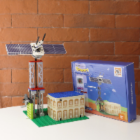

# innobit


## Feature

* This extension is designed to programme and drive the moudule series innobit for micro:bit, which aim at supporting the coding and programming self-learning kits for beginers, "The future city". You can get [The future city from SteamFun](http://www.steamfun.co.uk/shop)

1. The module adopts a high-quality plastic shell structure. Combining with lego in the kits, you can make projects by following the subjects in the kits or on your own design.

2. There are 2 motor ports, 1 input and 1 output port on the innobit, so that children can connect the wire easily and correctly.

3. A variety of sensors are included, motors and electric fans for the motor ports, PIR sensor, sonar sensor and humidity and temperature sensor for the input port and the servo and the LED for the output port.

4. The future city is still developing, more sensors may be added later.

## Basic usage

* Turn on and off the motor on port M1 and M2 

```blocks

input.onButtonPressed(Button.A, function () {
    innobit.motor_M1(255)
    innobit.motor_M2(255)
})
input.onButtonPressed(Button.B, function () {
    innobit.motor_M1(0)
    innobit.motor_M2(0)
})

```
---

* Temperature and humidity data will be displayed on micro:bit

```blocks
input.onButtonPressed(Button.A, function () {
    basic.showNumber(innobit.readTemperature())
})
input.onButtonPressed(Button.B, function () {
    basic.showNumber(innobit.readHumidity())
})

```
---

* Turn on the lights
```blocks
input.onButtonPressed(Button.A, function () {
    innobit.LED_setPixelColor3(innobit.colors(NeoPixelColors.Red), innobit.colors(NeoPixelColors.Yellow), innobit.colors(NeoPixelColors.Green))
})
```
---

* Turn the servo to different angles

```blocks
input.onButtonPressed(Button.A, function () {
    innobit.createServo(90)
})
input.onButtonPressed(Button.B, function () {
    innobit.createServo(0)
})
```
---
* When people pass through the PIR sensor, the PIRvalue equal to 1
```blocks
basic.forever(function () {
    if (innobit.PIRvalue() == 1) {
        basic.showIcon(IconNames.StickFigure)
    } else if (innobit.PIRvalue() == 0) {
        basic.clearScreen()
    }
})
```
---

* Turn on and off the electric fan, the maximum power of the fann is 100 percent
```blocks

input.onButtonPressed(Button.A, function () {
    innobit.fan_M1(100)
})
input.onButtonPressed(Button.B, function () {
    innobit.fan_M1(0)
})
```
---

* The distance between the nearest object and the sonar sensor will be displayed on the micro:bit
```blocks
input.onButtonPressed(Button.A, function () {
    basic.showNumber(innobit.distanceInch())
})
input.onButtonPressed(Button.B, function () {
    basic.showNumber(innobit.distanceCM())
})

```
---

## License

MIT

## Supported targets

* for PXT/microbit
